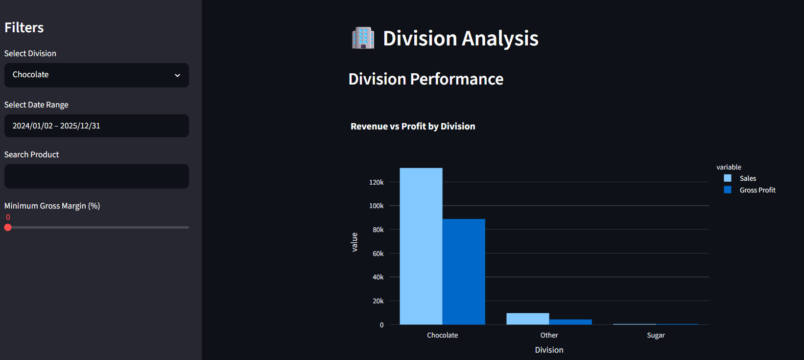
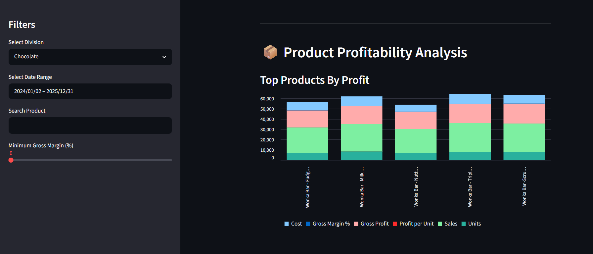
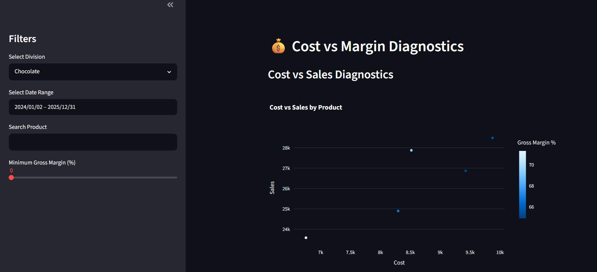
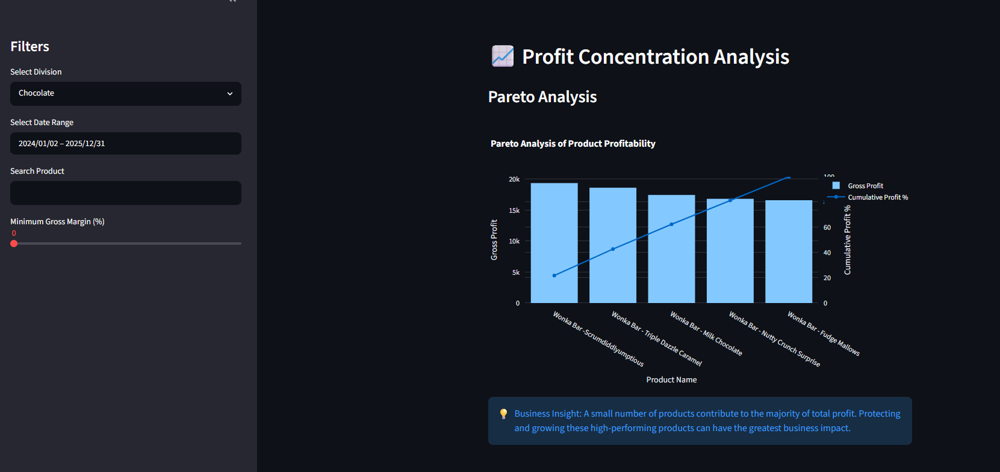

# 🍬 Nassau Candy Profitability Dashboard

## 📌 Project Overview

The Nassau Candy Profitability Dashboard is an interactive business intelligence application built using **Python**, **Pandas**, **Plotly**, and **Streamlit**. It helps analyze product profitability, identify high-performing products, detect low-margin products, and provide actionable business insights through interactive visualizations.

---

## 🎯 Business Objective

The dashboard enables business stakeholders to:

- Monitor overall sales and profitability
- Compare revenue and profit across divisions
- Identify high-margin and low-margin products
- Detect high-cost products affecting profitability
- Analyze profit concentration using Pareto Analysis
- Support pricing and cost optimization decisions

---

## 🚀 Features

- 📊 Interactive KPI Cards
- 🏢 Division Filter
- 📅 Date Range Filter
- 🔍 Product Search
- 🎚️ Gross Margin Threshold Slider
- 💰 Top Products by Gross Profit
- 📈 Top Products by Gross Margin
- ⚠️ High Sales – Low Margin Analysis
- 📉 Low Sales – Low Profit Analysis
- 💵 Cost vs Sales Scatter Plot
- 🚩 Margin Risk Detection
- 📦 Profit Contribution Analysis
- 📊 Pareto Analysis (80/20 Rule)
- 💡 Business Insights for Decision Making

---

## 🛠️ Tech Stack

- Python
- Pandas
- Streamlit
- Plotly Express
- Plotly Graph Objects

---

# 📷 Dashboard Preview

## Dashboard Home


---

## Division Performance



---

## Product Profitability



---

## Cost vs Margin Diagnostics



---

## Pareto Analysis



---

## 📂 Project Structure

```text
Nassau_Project/
│
├── dashboard/
│   └── app.py
│
├── data/
│   └── Cleaned_Nassau_Candy_Distributor.csv
│
├── screenshots/
│
├── README.md
├── requirements.txt
└── .gitignore
```

---

## ▶️ Run Locally

Clone the repository

```bash
git clone https://github.com/Harshada-Navghane/Nassau-Candy-Profitability-Dashboard.git
```

Go to the project directory

```bash
cd Nassau-Candy-Profitability-Dashboard
```

Install dependencies

```bash
pip install -r requirements.txt
```

Run the application

```bash
streamlit run dashboard/app.py
```

---

## 📈 Future Improvements

- Deploy dashboard to Streamlit Community Cloud
- Add advanced filtering options
- Add export to PDF/Excel
- Include trend analysis over time
- Improve dashboard responsiveness

---

## 👩‍💻 Author

**Harshada Navghane**

Aspiring Data Analyst passionate about Python, SQL, Power BI, Streamlit, and Business Intelligence.